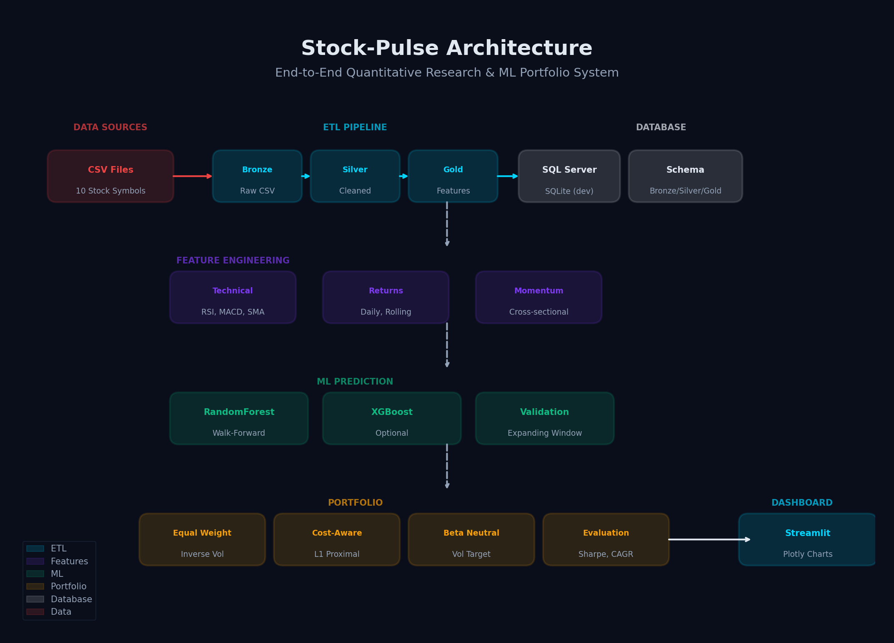

# Stock-Pulse

> An end-to-end quantitative research and ML portfolio system for Indian equities — combining walk-forward machine learning, technical analysis, causal backtesting, and an interactive Streamlit dashboard for retail investors and quantitative researchers.

---

## Table of Contents

- [Overview](#overview)
- [Problem Statement](#problem-statement)
- [Project Goals](#project-goals)
- [Dashboard Pages](#dashboard-pages)
- [Project Architecture](#project-architecture)
- [Data Warehouse Architecture](#data-warehouse-architecture)
- [ML Pipeline](#ml-pipeline)
- [Key Features Engineered](#key-features-engineered)
- [Model Evaluation Metrics](#model-evaluation-metrics)
- [Tech Stack](#tech-stack)
- [Project Structure](#project-structure)
- [Setup & Installation](#setup--installation)
- [Running the App](#running-the-app)
- [Configuration](#configuration)
- [Author](#author)

---

## Overview

**Stock-Pulse** is a production-grade AI decision-support system built for Indian stock market participants. It ingests historical OHLCV data, engineers causal time-series features, trains walk-forward ML models (RandomForest, XGBoost), and produces **predicted return signals**, **strategy positions**, and **risk-adjusted portfolio metrics** — all explainable via feature importance and interactive visualizations.

The system is deployed as a **multi-page Streamlit web application** with support for single-stock technical analysis, ML strategy backtesting with transaction costs, cross-sectional portfolio construction, and real-time strategy comparison against SMA benchmarks.

---

## Problem Statement

Retail investors and small quantitative traders in India face several challenges when applying machine learning to stock trading:

- **Overfitting risk** — Most ML models are trained on full history and tested on the same data, leading to inflated performance that collapses in live trading
- **No causal validation** — Models often use future information accidentally (lookahead bias), making backtests unreliable
- **High complexity** — Existing quant platforms require coding knowledge and statistical expertise, alienating beginners
- **Poor interpretability** — Black-box predictions without explanations make it hard to trust or audit model decisions
- **Lack of Indian focus** — Most tools are built for US markets with USD pricing and Western brokerage assumptions
- **No transaction cost modeling** — Backtests ignore brokerage fees and slippage, making real-world performance much worse

Without rigorous walk-forward validation and cost-aware execution, ML trading strategies fail when deployed with real money.

---

## Project Goals

| # | Goal | Description |
|---|------|-------------|
| 1 | **Causal Walk-Forward Validation** | Train on past data, test on future data with chronological splits — no future leakage |
| 2 | **Beginner-Friendly Interface** | Simple Mode with 4 controls so non-coders can use ML trading immediately |
| 3 | **Explainable Predictions** | Every chart shows What, Why, How with verdicts and Indian market benchmarks |
| 4 | **Transaction Cost Awareness** | Model brokerage fees (0.1-0.2%) and slippage so backtests reflect reality |
| 5 | **Cross-Sectional Portfolios** | Combine multiple stocks into diversified ML portfolios with risk controls |
| 6 | **SMA Benchmark Comparison** | Head-to-head ML vs rule-based SMA crossover on the same calendar window |

---

## Dashboard Pages

The Streamlit app has **3 core views** accessible from the sidebar:

### Stock Analysis
Interactive technical analysis with candlestick charts, SMA overlays, RSI/MACD indicators, and buy/sell signal markers. Shows key metrics with Indian market benchmarks and a strategy vs buy-and-hold performance comparison.

### ML Strategy (Walk-Forward)
The main quantitative engine. Features include:
- Chronological walk-forward validation with next-bar execution
- Optional risk-free carry on flat cash positions
- Head-to-head comparison vs SMA benchmark on same calendar window
- Risk-Return bubble charts (CAGR vs Max Drawdown vs Sharpe)
- Prediction distribution histograms
- Rolling Information Coefficient (IC) tracking
- Underwater drawdown curves
- Feature importance with stability analysis
- Cross-sectional ML portfolio construction

### Portfolio Builder
Multi-stock portfolio analysis with correlation heatmaps and combined risk metrics.

---

## Project Architecture

```
Data Sources (CSV)
       |
       v
+-------------------------------+
|         ETL Pipeline          |
|                               |
|  CSV Ingestion                |
|       |                       |
|       v                       |
|  Bronze Layer (Raw Data)      |
|       |                       |
|       v                       |
|  Silver Layer (Standardized)  |
|       |                       |
|       v                       |
|  Gold Layer (Features)        |
+-------------------------------+
       |
       v
+-------------------------------+
|      Data Warehouse           |
|                               |
|  SQL Server (production)      |
|  SQLite (quick demo)          |
+-------------------------------+
       |
       v
+-------------------------------+
|    ML Prediction Pipeline     |
|                               |
|  Feature Prep -> Walk-Forward |
|    -> RandomForest/XGBoost    |
|    -> Signal Generation       |
|    -> Backtest with Costs     |
+-------------------------------+
       |
       v
+-------------------------------+
|    Streamlit Dashboard        |
|    (Multi-page App)           |
+-------------------------------+
```

---

## Data Warehouse Architecture

Stock-Pulse uses a **Medallion Architecture** (Bronze/Silver/Gold) implemented in SQL Server or SQLite:

| Layer | Name | Purpose | Schema |
|-------|------|---------|--------|
| **Bronze** | Raw Data | Stores raw CSV data as-is | `bronze_schema.sql` |
| **Silver** | Standardized | Cleaned, deduplicated, aligned types | `silver_schema.sql` |
| **Gold** | Features | Technical indicators + ML targets | `gold_schema.sql` |

Stored procedures handle the transitions:
- `load_bronze_to_silver.sql` — Cleans and standardizes raw data
- `load_silver_to_gold.sql` — Engineers features and targets

## Architecture Diagram



**Architecture Overview:**
1. **Data Sources** — CSV files with OHLCV data for Indian stocks
2. **ETL Pipeline** — Bronze -> Silver -> Gold layers with standardization
3. **Data Warehouse** — SQL Server (production) or SQLite (local demo)
4. **Feature Engineering** — Technical indicators (RSI, MACD, SMA), causal targets
5. **ML Prediction** — RandomForest / XGBoost with walk-forward validation
6. **Portfolio** — Equal-weight, inverse-vol, cost-aware execution, beta-neutral options
7. **Dashboard** — Streamlit with Plotly visualizations, simple and advanced modes

## ML Pipeline

### 1. Data Ingestion (`etl/ingestion/csv_ingestion.py`)
- Loads CSV files with OHLCV data for Indian stocks
- Standardizes column names and data types
- Archives processed files to prevent re-processing

### 2. Bronze Layer (Raw Data)
- Stores raw CSV data as-is in `warehouse/schema_definitions/bronze_schema.sql`
- No transformations, just data landing

### 3. Silver Layer (Standardized)
- Standardizes data types, handles missing values
- Removes duplicates, aligns columns
- Schema: `warehouse/schema_definitions/silver_schema.sql`

### 4. Gold Layer (Features)
- Constructs 10+ technical indicators: SMA, RSI, MACD, daily returns
- Creates causal target variables (forward-looking returns with proper lag)
- Supports 1-day, 20-day, and 60-day prediction horizons
- Schema: `warehouse/schema_definitions/gold_schema.sql`

### 5. Data Warehouse Load
- Loads Gold layer data into SQL Server or SQLite
- Stored procedures: `warehouse/procedures/load_bronze_to_silver.sql` and `load_silver_to_gold.sql`

### 6. Walk-Forward Validation (`dashboard/services/prediction_models/walk_forward.py`)
- Single split: 70% train, 30% test (baseline)
- Rolling expanding window: Train grows, test slides forward
- Ensures predictions use only past data, no future leakage

### 7. Model Training (`dashboard/services/prediction_models/random_forest.py`)
- RandomForest: Robust ensemble, default for all users
- XGBoost: Gradient boosting, optional if installed
- Models trained on expanding windows, tested on held-out periods

### 8. Signal Generation (`dashboard/services/prediction_models/ml_backtest.py`)
- Static thresholds: Fixed prediction cutoff
- Expanding quantiles: Dynamic thresholds based on rolling history
- Discrete positions: 0/1/-1 (flat, long, short)
- Confidence-weighted: Fractional exposure based on prediction strength

### 9. Backtesting (`dashboard/services/prediction_models/ml_backtest.py`)
- Next-bar execution with lagged positions
- Transaction cost modeling (0.001 - 0.002 per trade)
- Optional risk-free rate on cash (5% annual)
- Strategy returns compared to buy-and-hold benchmark

### 10. Evaluation (`dashboard/services/prediction_models/ml_backtest.py`)
- CAGR, Sharpe ratio, Max Drawdown
- Rolling Information Coefficient (IC)
- IC half-life and decay analysis
- Realized turnover metrics
- Feature importance aggregation across folds

---

## Key Features Engineered

### Technical Indicators
| Feature | Description |
|---------|-------------|
| `sma_20` | 20-day simple moving average |
| `sma_50` | 50-day simple moving average |
| `rsi_14` | 14-day Relative Strength Index |
| `macd_line` | MACD line (12-26 EMA difference) |
| `macd_signal` | MACD signal line (9 EMA) |
| `macd_hist` | MACD histogram |
| `daily_return` | Percentage daily return |

### Target Variables
| Feature | Description |
|---------|-------------|
| `target` | Future return at selected horizon (1/20/60 days) |
| `sym_mu` | Expanding causal mean return by symbol (panel mode) |

### Strategy Features
| Feature | Description |
|---------|-------------|
| `position` | Strategy position: 0 (flat), 1 (long), -1 (short) |
| `strategy_return` | Net return after transaction costs |
| `cum_strategy_return` | Cumulative compounded return |
| `underwater` | Drawdown from peak (peak - current) / peak |

---

## Model Evaluation Metrics

| Metric | Description |
|--------|-------------|
| **CAGR** | Compound Annual Growth Rate — yearly return if strategy compounded |
| **Sharpe Ratio** | Risk-adjusted return: return per unit of volatility |
| **Max Drawdown** | Largest peak-to-trough decline (worst-case loss) |
| **Information Coefficient (IC)** | Spearman correlation between prediction and realized return |
| **IC Half-Life** | How many days before IC decays to half its value |
| **Turnover** | Frequency of trading (high = more transaction costs) |
| **Rolling IC** | Time-series of IC to check consistency over time |

> **Note:** IC is the primary metric for model quality. IC > 0.05 indicates the model has genuine predictive power. IC > 0.10 is strong. Negative IC means the model is backwards — flip the signals.

---

## Tech Stack

| Category | Technology | Purpose |
|----------|-----------|---------|
| **Language** | Python 3.13+ | Core ML pipeline and dashboard |
| **ML Models** | Scikit-learn (RandomForest), optional XGBoost | Time-series prediction |
| **Data Processing** | Pandas, NumPy | Data manipulation and feature engineering |
| **Visualization** | Plotly | Interactive charts and dark theme |
| **Dashboard** | Streamlit | Multi-page web application |
| **Database** | SQL Server (pyodbc), SQLite | Production and demo backends |
| **ETL** | Custom Python pipeline | Bronze -> Silver -> Gold architecture |
| **Config** | python-dotenv | Environment variable management |

---

## Project Structure

```
Stock-Pulse/
|
├── dashboard/                    # Streamlit application
│   ├── main.py                   # App entry point
│   ├── database/                 # Database connections
│   │   ├── connection.py         # SQL Server + SQLite support
│   │   └── queries.py            # SQL queries
│   ├── services/                 # Business logic
│   │   ├── data_service.py       # Data fetching with error handling
│   │   ├── portfolio_service.py  # Portfolio calculations
│   │   └── prediction_models/    # ML pipeline
│   │       ├── feature_prep.py   # Feature engineering
│   │       ├── ml_backtest.py    # Backtesting engine
│   │       ├── ml_portfolio.py   # Portfolio construction
│   │       ├── random_forest.py  # RandomForest model
│   │       ├── walk_forward.py   # Walk-forward validation
│   │       ├── xgboost_model.py  # XGBoost model (optional)
│   │       └── cross_sectional_ml.py  # Multi-stock panel
│   ├── views/                    # Dashboard pages
│   │   ├── stock_analysis.py     # Technical analysis view
│   │   └── ml_strategy.py        # ML strategy view
│   ├── components/               # Reusable UI components
│   ├── config/                   # Dashboard config
│   ├── styles/                   # Chart themes
│   │   ├── chart_theme.py        # Plotly theme
│   │   └── tokens.py             # Color tokens
│   └── assets/                   # Logo and images
│
├── etl/                          # Data pipeline
│   ├── ingestion/                # CSV loading
│   ├── processing/               # Feature engineering
│   │   ├── gold_feature_engineering.py
│   │   └── silver_standardization.py
│   ├── storage/                  # Database writer
│   └── run_pipeline.py           # ETL orchestrator
│
├── data_sources/                 # Raw CSV files
│   ├── incoming_csv/             # New CSV files
│   ├── processed_archive/        # Processed files
│   └── rejected/                 # Failed/invalid CSV files
│
├── tests/                        # Unit tests
│   ├── test_prediction_models.py
│   └── test_gold_feature_engineering.py
│
├── docs/                         # Documentation
│   ├── architecture_diagram.png
│   └── generate_architecture.py
│
├── configuration/                # Config files
│   ├── .env                      # Environment variables
│   └── env.example               # Example environment file
│
├── warehouse/                    # Data Warehouse (Medallion Architecture)
│   ├── schema_definitions/
│   │   ├── bronze_schema.sql     # Raw data layer
│   │   ├── silver_schema.sql     # Standardized layer
│   │   └── gold_schema.sql       # Feature-engineered layer
│   ├── procedures/
│   │   ├── load_bronze_to_silver.sql
│   │   └── load_silver_to_gold.sql
│   └── seed_data/
│
├── .streamlit/                   # Streamlit config
│   └── config.toml               # Theme and UI settings
│
├── requirements.txt              # Python dependencies
└── README.md                     # This file
```

---

## Setup & Installation

### Prerequisites
- Python 3.13 or higher
- pip
- SQL Server (optional, for production) or SQLite (for demo)

### 1. Clone the repository
```bash
git clone https://github.com/ankit-bind/Stock-Pulse.git
cd Stock-Pulse
```

### 2. Create and activate a virtual environment
```bash
python -m venv venv
# Windows
venv\Scripts\activate
# macOS / Linux
source venv/bin/activate
```

### 3. Install dependencies
```bash
pip install -r requirements.txt
```

### 4. Configure database

**Option A: SQL Server (Production Data Warehouse)**
1. Ensure SQL Server is running (`localhost\SQLEXPRESS`)
2. Update `configuration/.env`:
   ```
   DB_SERVER=localhost\SQLEXPRESS
   DB_NAME=StockPulse
   DB_DRIVER=ODBC+Driver+17+for+SQL+Server
   DB_TRUSTED_CONNECTION=yes
   ```
3. Run ETL: `python -m etl.run_pipeline`

**Option B: SQLite (Quick Demo Warehouse)**
1. Set `USE_SQLITE=true` in `configuration/.env`
2. Run ETL: `python -m etl.run_pipeline`
3. No SQL Server required — creates local SQLite data warehouse

### 5. Run ETL Pipeline
```bash
python -m etl.run_pipeline
```

This executes the full Medallion Architecture:
- **Bronze**: Raw CSV data loaded as-is
- **Silver**: Standardized, cleaned, and deduplicated
- **Gold**: Feature-engineered with technical indicators and targets

---

## Running the App

```bash
streamlit run dashboard/main.py
```

The dashboard will open at `http://localhost:8501`.

> **Database required:** The dashboard reads from the database populated by the ETL pipeline. Run `python -m etl.run_pipeline` first.

---

## Configuration

All pipeline behavior is controlled via environment variables in `configuration/.env`:

| Variable | Purpose |
|----------|---------|
| `DB_SERVER` | SQL Server instance name |
| `DB_NAME` | Database name |
| `DB_DRIVER` | ODBC driver |
| `DB_TRUSTED_CONNECTION` | Windows auth (yes/no) |
| `USE_SQLITE` | Use SQLite instead of SQL Server (true/false) |

To change prediction horizons or model parameters, edit the code in `dashboard/views/ml_strategy.py`.

---

## Dashboard Usage

### For Beginners
1. Select **Simple Mode** in the sidebar
2. Choose a **Quick Preset**: Beginner (Easy), Balanced (Standard), or Aggressive (Pro)
3. Select a stock (e.g., TCS.NS)
4. Click **Run**
5. Read the chart explanations (What/Why/How) below each visualization

### For Advanced Users
1. Select **Advanced Mode** in the sidebar
2. Configure: model, horizon, walk-forward mode, thresholds, position style
3. Adjust transaction costs and risk-free rate
4. Run cross-sectional portfolio across multiple stocks
5. Export results to CSV

---

## Results (Example)

Tested on **TCS.NS** with 2,776 rows of historical data:

| Preset | Horizon | Signal | CAGR | Max DD | Sharpe | IC |
|--------|---------|--------|------|--------|--------|-----|
| Beginner | 60-day | Long only | 6.82% | -33.09% | 0.03 | 0.0724 |
| Balanced | 20-day | Long/Short | 5.86% | -29.46% | 0.02 | 0.0278 |
| Aggressive | 20-day | Long/Short | 2.19% | -31.41% | 0.01 | - |

> **Beginner preset (60-day) outperformed Buy & Hold (6.82% vs 4.70%) with the highest IC (0.0724), indicating genuine predictive power.**

---

## Screenshots

### Stock Analysis Page
Technical analysis with candlestick charts, SMA overlays, RSI/MACD indicators, and buy/sell signals.


### ML Strategy Page
Walk-forward backtesting with cumulative returns, risk metrics, and chart explanations.


### Portfolio Builder
Multi-stock portfolio analysis with correlation heatmaps.


---

## Author

**Ankit**
- Email: itz.ankitbind01@gmail.com
- Project: Stock-Pulse
- Version: 1.0

---

> **Disclaimer:** This application is for educational and research purposes only. All predictions are probabilistic estimates based on historical data patterns. Past performance does not guarantee future results. Trading involves substantial risk of loss. Please consult a financial advisor before making investment decisions.
