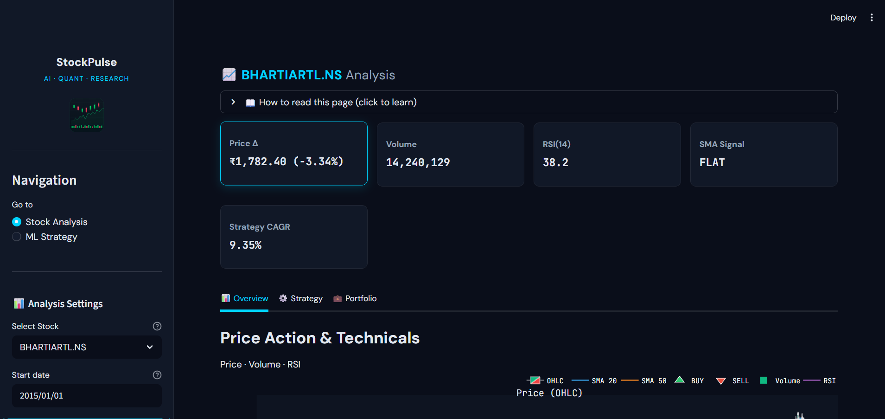
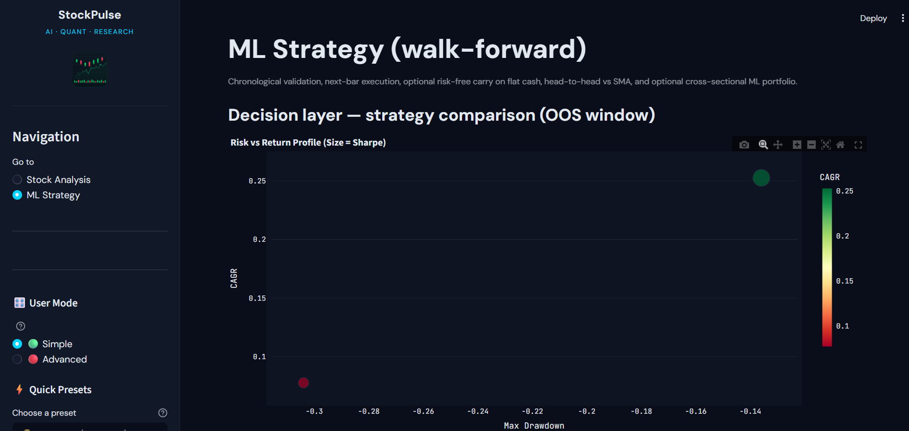
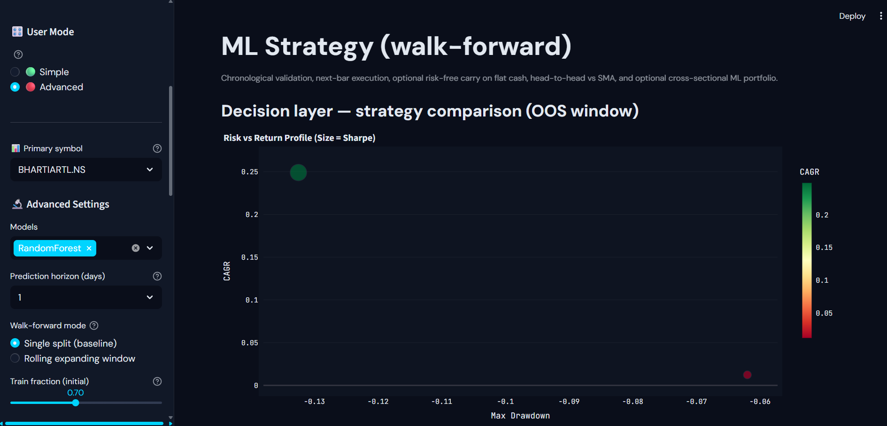

# Stock-Pulse

End-to-end quantitative research and ML portfolio system: **ETL → features → ML → signals → portfolio construction → evaluation**, with causal execution, transaction costs, and cross-sectional books suitable for production-style backtests.

## 1. Overview

Stock-Pulse ingests market data, engineers time-series and panel features, trains walk-forward ML models (e.g. RandomForest, optional XGBoost), turns predictions into positions or weights, and compares outcomes to rule baselines (e.g. SMA crossover). The **Streamlit dashboard** (`dashboard/main.py`) is the primary interface for exploration, diagnostics, and strategy comparison.

## 2. Pipeline

| Stage | Role |
|--------|------|
| **ETL / data** | Load OHLCV-style history (e.g. from `stock_prices_gold` or CSV gold tables). |
| **Features** | Causal indicators and targets (`create_features`); panel adds **sym_mu** (expanding causal mean of `target` by symbol) and calendar features. |
| **ML** | Per-symbol walk-forward or **pooled panel** walk-forward by calendar; lagged predictions vs realized returns. |
| **Signals** | Static / expanding / OOS quantile thresholds; discrete or confidence-weighted positions. |
| **Portfolio** | Equal-weight or inverse-vol (global or rolling/EWMA σ) combination of legs; **score-quantile long/short** with CS demean, optional **β-neutral** projection, **cost-aware** execution (proximal L1, no-trade band, turnover cap), **IC-driven rebalance k**, optional **vol targeting** (12% ann. default). |
| **Evaluation** | Sharpe, CAGR, max drawdown, underwater curves, rolling IC, cross-sectional IC / half-life, turnover (gross L1 and **½L1 dollar turnover**), coverage, attribution sleeves. |

## 3. Key assumptions

- **Lagged execution**: Score-quantile portfolio PnL uses **prior-day weights × same-day returns** `(w.shift(1) · r)` so weights are known before the return they earn.
- **Transaction costs**: Discrete ML backtest path supports per-unit cost drag; panel score book supports **per-name L1 proximal cost**, implied drag ≈ **½L1 turnover × cost**, and turnover caps.
- **Risk-free / cash**: Optional RF accrual on flat exposure where modeled (see `attach_ml_strategy_returns`).
- **Causal thresholds**: Prefer **expanding quantile** thresholds (`shift(1)`) over full-window OOS quantiles when you need strict causality.
- **Panel walk-forward**: Expanding calendar splits; optional **embargo** (business days before each test chunk) trims training rows near the test window to reduce label-overlap leakage.
- **Vol targeting**: Optional causal leverage from rolling realized vol (annualized), `shift(1)` on leverage, cap (default 2×), target vol default **12%** annualized.

## 4. Strategies compared

- **SMA crossover** benchmark on the same calendar window as ML OOS where applicable.
- **ML (RandomForest, XGBoost if installed)**: walk-forward OOS predictions → discrete or confidence positions.
- **Cross-sectional ML**: pooled model on stacked universe + **bucket rank** or **score-quantile** dollar-neutral book with the portfolio controls above.

## 5. Results (how to read them)

Numbers depend on your universe, dates, and hyperparameters. Interpret the stack as follows:

- **Sharpe / max DD**: Primary risk-adjusted and tail metrics on **net** (or cost-adjusted where applied) return series.
- **Turnover**: **Avg dollar TO (½L1)** aligns with common reporting and linear cost intuition; gross **‖Δw‖₁** is shown alongside.
- **IC**: Rolling or cross-sectional IC and **half-life** inform how fast the signal decays and whether **rebalance k** (manual or IC-auto) is reasonable.
- **Coverage**: Thin cross-sections can distort panel stats; optional coverage-weighted returns are available.

Example narrative patterns (verify on your data before claiming exact magnitudes):

- ML signals often show **small but positive OOS IC** when the signal is real and the horizon matches the target.
- **Turnover and cost controls** (prox, band, cap, auto-k) tend to **lift net Sharpe** when gross alpha is strong but noisy trades were eating costs.
- **Cross-sectional** books can **smooth idiosyncratic noise** vs single-name ML, sometimes improving drawdowns at the expense of headline gross return.

## 6. Running locally

```bash
python -m venv venv
venv\Scripts\activate
pip install -r requirements.txt
streamlit run dashboard/main.py
```

### Database Configuration

**Option A: SQL Server (production)**
1. Ensure SQL Server is running (`localhost\SQLEXPRESS`)
2. Check `configuration/.env` has correct credentials:
   ```
   DB_SERVER=localhost\SQLEXPRESS
   DB_NAME=StockPulse
   DB_DRIVER=ODBC+Driver+17+for+SQL+Server
   DB_TRUSTED_CONNECTION=yes
   ```
3. Run ETL pipeline: `python -m etl.run_pipeline`

**Option B: SQLite (quick demo)**
1. Set `USE_SQLITE=true` in `configuration/.env`
2. Run ETL pipeline: `python -m etl.run_pipeline`
3. No SQL Server required — perfect for quick demos

Configure database / paths as required for your environment (do not commit secrets).

## 7. Screenshots

```markdown



```

### Architecture


**Architecture Overview:**
1. **Data Sources** → CSV files with OHLCV data
2. **ETL Pipeline** → Bronze → Silver → Gold layers
3. **Database** → SQL Server or SQLite (with toggle)
4. **Feature Engineering** → Technical indicators (RSI, MACD, SMA)
5. **ML Prediction** → RandomForest / XGBoost with walk-forward validation
6. **Portfolio** → Equal-weight, inverse-vol, cost-aware execution
7. **Dashboard** → Streamlit with Plotly visualizations

---

## 8. Tests

```bash
python -m unittest tests.test_prediction_models -v
```

---

*This README describes design intent and evaluation framing; it is not investment advice.*
